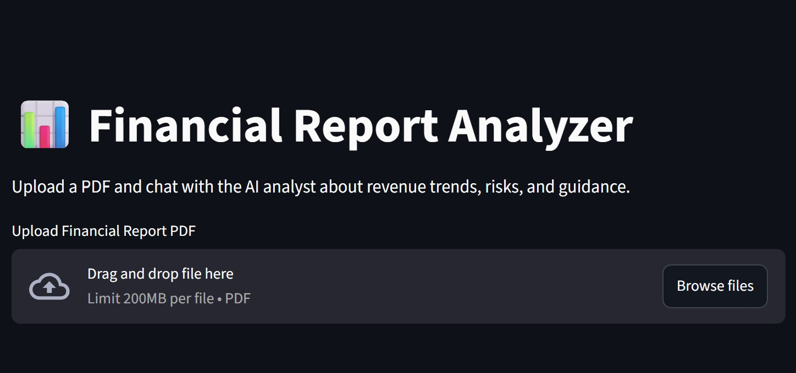

# 📊 Financial Report Analyzer

A Streamlit application that lets you upload a financial report (PDF) and interact with it using Groq LLMs.  
The app generates an executive summary and supports interactive Q&A so stakeholders can quickly understand revenue trends, growth drivers, risks, and forward guidance.

---

## 🚀 Features
- Upload PDF financial reports
- Automatic executive summary
- Interactive Q&A
- Powered by Groq models (`llama-3.3-70b-versatile`)
- Built with LangChain + PyMuPDF + Streamlit

---
## 📸 Demo

Demo video (`Demo.mp4`) is available in the repository.
