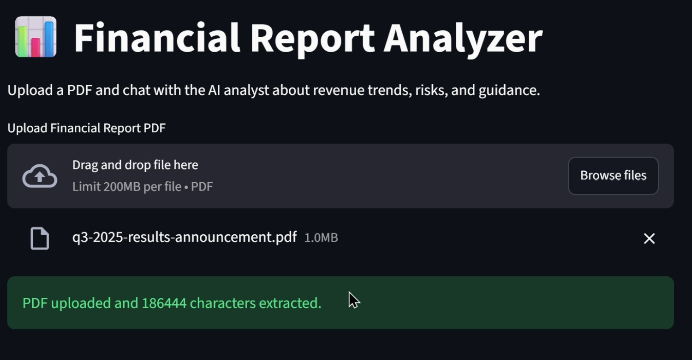
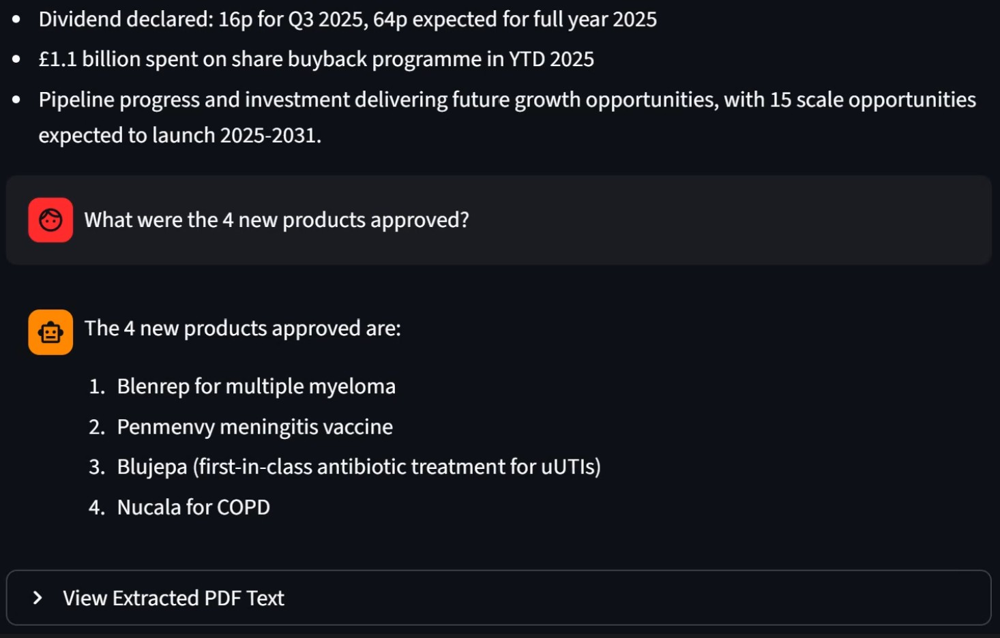

# AI Finance Report Analysis

An intelligent document analysis tool powered by AI that enables financial professionals to extract insights from PDF financial reports in seconds. Upload any financial document and leverage AI-powered natural language processing to generate summaries, answer questions, and uncover key metrics instantly.

## Overview

The **AI Finance Report Analyzer** is a Streamlit-based web application designed for financial analysts, investors, and stakeholders who need to quickly understand financial reports. Instead of manually reading through lengthy PDFs, users can:

- **Instantly generate** executive summaries highlighting revenue trends, growth drivers, risks, and guidance
- **Ask questions** to the document and get precise answers based on the report content
- **Extract insights** without requiring deep technical knowledge

## Key Features

| Feature | Description |
|---------|-------------|
| **PDF Upload** | Easily upload financial reports in PDF format |
| **Auto Summarization** | AI-generated executive summaries in seconds |
| **Interactive Q&A** | Ask natural language questions and get instant answers |
| **Advanced AI Model** | Powered by Llama 3.3 (70B) via Groq for superior accuracy |
| **Fast Processing** | Groq's low-latency API ensures rapid responses |
| **Privacy** | Your documents are processed securely |
| **User-Friendly Interface** | Intuitive Streamlit UI requires no coding knowledge |

## 🛠 Tech Stack

- **Frontend**: [Streamlit](https://streamlit.io/) - Python web framework for data apps
- **LLM Integration**: [LangChain](https://www.langchain.com/) - Framework for LLM applications
- **AI Model**: [Groq API](https://groq.com/) - `llama-3.3-70b-versatile` model
- **PDF Processing**: [PyMuPDF (fitz)](https://pymupdf.readthedocs.io/) - PDF text extraction
- **Language**: Python 3.8+

## Installation

### Prerequisites
- Python 3.8 or higher
- A Groq API key (free at [groq.com](https://groq.com))
- pip (Python package manager)

### Setup Steps

1. **Clone the repository**
   ```bash
   git clone <repository-url>
   cd AI-Finance-Report-Analysis
   ```

2. **Create a virtual environment** (recommended)
   ```bash
   python -m venv venv
   source venv/bin/activate  # On Windows: venv\Scripts\activate
   ```

3. **Install dependencies**
   ```bash
   pip install streamlit langchain langchain-groq pymupdf
   ```

4. **Get your Groq API Key**
   - Visit [console.groq.com](https://console.groq.com)
   - Sign up or log in
   - Generate an API key from the dashboard
   - Keep it secure (don't commit to version control)

## Usage

1. **Run the application**
   ```bash
   streamlit run app.py
   ```

2. **Access the web interface**
   - Open your browser to `http://localhost:8501`
   - You should see the Streamlit app running

3. **Enter your Groq API Key**
   - In the left sidebar, paste your Groq API key
   - The app will validate the key before proceeding

4. **Upload a Financial Report**
   - Click the "Upload a PDF file" button
   - Select your financial report (PDF format)
   - Wait for the file to be processed

5. **View Auto-Generated Summary**
   - Once uploaded, the app automatically generates an executive summary
   - Review key revenue trends, growth drivers, risks, and forward guidance

6. **Ask Questions (Q&A)**
   - Type any question about the report in the text input
   - Click "Ask" or press Enter
   - Get instant, precise answers based on the document content
   - Ask follow-up questions in a conversational manner

## How It Works

```
User Upload PDF
        ↓
Extract Text (PyMuPDF)
        ↓
Send to Groq LLM (llama-3.3-70b)
        ↓
Receive Response
        ↓
Display in Streamlit UI
```

### Processing Flow

1. **PDF Text Extraction**: Uses PyMuPDF to efficiently extract text from uploaded PDF files
2. **LLM Processing**: Sends extracted text to Groq's API using LangChain integration
3. **Response Generation**: 
   - For summaries: Analyzes the full document to extract key financial metrics and insights
   - For Q&A: Contextually answers user questions based on document content
4. **Display**: Results are rendered in the Streamlit interface for easy reading

## Demo

Here are screenshots showing the app in action:

### 1. Main Interface


### 2. Report Loaded


### 3. Interactive Chat


A demo video (`Demo.mp4`) is also included in the repository.

## ⚙️ Configuration

### Environment Variables
You can set your Groq API key as an environment variable instead of entering it in the UI:

```bash
export GROQ_API_KEY=your_api_key_here
```

Then run:
```bash
streamlit run app.py
```

### Customization

Edit these parameters in `app.py` to customize behavior:

- **Model Choice**: Change `model_name` in the `ChatGroq` initialization (line 18)
- **Temperature**: Adjust the `temperature` parameter for more/less creative responses
- **Text Limit**: Modify the character limit (first 4000 chars) in summarize and Q&A functions
- **Prompts**: Edit the system prompts in `summarize_report()` and `answer_question()` functions

## File Structure

```
AI-Finance-Report-Analysis/
├── app.py              # Main Streamlit application
├── readme.md           # This file
├── Demo.mp4            # Demo video
├── Tool-UI.jpg         # Screenshot of interface
├── Loaded.jpg          # Screenshot of loaded report
└── Chatting.jpg        # Screenshot of Q&A in action
```

## Use Cases

- **Investment Analysis**: Quickly analyze quarterly earnings reports before investment decisions
- **Due Diligence**: Accelerate M&A processes by analyzing acquisition targets' financials
- **Risk Assessment**: Identify key risks and red flags in financial reports
- **Competitor Analysis**: Extract insights from competitor financial disclosures
- **Student Learning**: Understand complex financial documents for educational purposes
- **Report Review**: Speed up internal financial document reviews and audits

## Limitations & Notes

- **Text Length**: Currently uses first 4000 characters of the report. For longer documents, consider splitting into sections or increasing this limit
- **PDF Quality**: Works best with text-based PDFs. Scanned image-based PDFs require OCR preprocessing
- **Model Accuracy**: Responses are based on the Llama 3.3 model's training data and reasoning capabilities
- **Cost**: Groq provides free tier access; check their pricing for high-volume usage

## Troubleshooting

| Issue | Solution |
|-------|----------|
| "API key not found" error | Ensure your Groq API key is correctly set in the sidebar or environment variable |
| Slow responses | Check your internet connection; Groq API may be experiencing high load |
| PDF extraction issues | Ensure your PDF is not corrupted and contains extractable text (not scanned image) |
| Module not found errors | Run `pip install -r requirements.txt` or install missing packages individually |
| Streamlit not responding | Try restarting the app with `Ctrl+C` and running `streamlit run app.py` again |

## Learning Resources

- [Streamlit Documentation](https://docs.streamlit.io/)
- [LangChain Documentation](https://python.langchain.com/)
- [Groq API Quickstart](https://console.groq.com/docs/quickstart)
- [PyMuPDF Documentation](https://pymupdf.readthedocs.io/)

## Contributing

Found a bug or have a feature idea? Contributions are welcome! Feel free to:
1. Open an issue describing the problem
2. Submit a pull request with improvements
3. Share feedback and suggestions


## FAQ

**Q: Can I process multiple documents at once?**  
A: Currently, the app processes one document at a time. You can process multiple documents sequentially.

**Q: Is my data secure?**  
A: Your data is sent to Groq's API servers. Check [Groq's privacy policy](https://groq.com/privacy) for details.

**Q: Can I modify the AI's behavior?**  
A: Yes! Edit the system prompts and model parameters in `app.py` to customize responses.

**Q: What file formats are supported?**  
A: Currently PDF format only. Other formats require conversion to PDF first.

